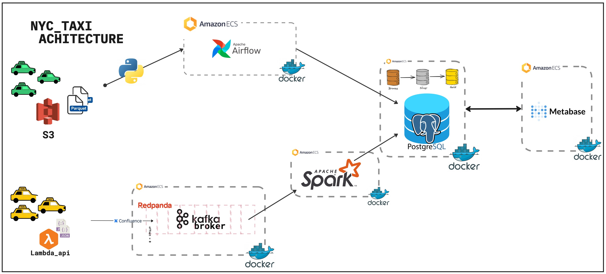

# NYC Taxi Data Pipeline

Production-grade data engineering platform implementing medallion architecture (Bronze → Silver → Gold) for NYC Taxi & Limousine Commission trip data. Demonstrates batch orchestration (Airflow), streaming (Spark/Redpanda), data warehousing (PostgreSQL), and observability (Metabase).

## Architecture



## Tech Stack

| Category | Technology |
|---|---|
| **Orchestration** | Apache Airflow 2.10.4 (LocalExecutor) |
| **Stream Processing** | Redpanda (Kafka v23.2.26) + Spark Structured Streaming |
| **Batch Processing** | Apache Spark 4.1.1 / PySpark |
| **Data Warehouse** | PostgreSQL 16 (medallion schema) |
| **BI & Visualization** | Metabase |
| **Containerization** | Docker / Docker Compose |
| **Language** | Python 3.13, SQL |
| **Package Manager** | uv (Python packaging) |

## Project Structure

```
nyc_taxi_cc/
├── docker-compose.yml                 # ⭐ Unified root compose (all services)
├── .env.example                       # Credential template (copy to .env)
├── pyproject.toml                     # Python dependencies
│
├── airflow_service/
│   ├── Dockerfile                     # Custom Airflow image with dependencies
│   ├── dags/
│   │   ├── data_ingestion.py          # Yellow taxi ETL + DQ checks
│   │   ├── green_cab_monthly.py       # Green taxi ETL + DQ checks
│   │   └── monthly_archival.py        # Table backups + preflight check
│   └── logs/                          # Airflow execution logs
│
├── spark-redpanda_service/
│   ├── Dockerfile                     # Custom Spark image (Java + PySpark)
│   ├── scripts/
│   │   ├── schemas.py                 # Shared Spark StructType definitions
│   │   ├── producer.py                # Parquet → Kafka/Redpanda producer
│   │   ├── consumer.py                # Kafka → Parquet batch consumer
│   │   ├── consumer_streaming.py      # Kafka → PostgreSQL streaming
│   │   └── consumer_pgdump.py         # Kafka → PostgreSQL batch
│   └── checkpoint/                    # Spark streaming checkpoints
│
├── datawarehouse_service/
│   ├── init/
│   │   └── 01_schema.sql              # Auto-initialized schema + indexes
│   └── nyc_taxi.psql                  # (Legacy, for reference)
│
├── bi_service/
│   ├── METABASE_DASHBOARD.md          # Pipeline health dashboard guide
│   └── metabase.toml                  # (Gitignored: local config)
│
├── data/
│   ├── yellow_taxi/                   # Yellow taxi parquet files (2024)
│   └── green_taxi/                    # Green taxi parquet files (2025)
│
└── README.md, CLAUDE.md                # (This file + Engineering practices)
```

## Getting Started

### Prerequisites
- Docker & Docker Compose v2+
- 4+ GB RAM (Spark + PostgreSQL + Redpanda require memory)
- Python 3.13+ (for local development)
- macOS / Linux / WSL2 (Windows native Docker has issues with Linux containers)

### Quick Start (All Services in One Command)

1. **Clone and setup**
   ```bash
   git clone https://github.com/DOthedot/nyc_taxi_cc.git
   cd nyc_taxi_cc
   cp .env.example .env
   # Edit .env and change all CHANGEME_IN_PROD passwords
   ```

2. **Start all services**
   ```bash
   docker compose up -d
   ```

   This starts:
   - PostgreSQL (warehouse) on port 5432
   - PostgreSQL (Airflow metadata) on port 5433
   - Airflow webserver on port 8080
   - Redpanda broker on port 9092
   - Redpanda console on port 8081
   - Spark master on port 7077 (cluster), 9090 (UI)
   - Spark worker + spark-submit container

3. **Wait for health checks** (~30-45 seconds)
   ```bash
   docker compose ps   # All should show "healthy"
   ```

4. **Access UIs**
   - Airflow: http://localhost:8080 (admin/your-password-from-.env)
   - Redpanda Console: http://localhost:8081
   - Spark Master UI: http://localhost:9090

### Running the Pipeline

#### Batch Ingestion (via Airflow)

1. **Trigger yellow taxi DAG** (requires `data/yellow_taxi/yellow_tripdata_2025-01.parquet`)
   - Go to Airflow UI → DAGs → `yellow_monthly_dump`
   - Click **Trigger DAG**
   - Set parameter `file_month=2025-01`
   - Tasks: ingest_bronze → validate_bronze → build_silver → build_gold → validate_gold

2. **Trigger green taxi DAG** (auto-downloads from TLC CDN)
   - Go to Airflow UI → DAGs → `taxi_data_pipeline`
   - Click **Trigger DAG**
   - Set parameter `file_month=2025-01`
   - Tasks: download → transform → ingest → validate → archive

3. **Run archival** (after at least one successful ingestion)
   - Go to Airflow UI → DAGs → `monthly_archival_pipeline`
   - Click **Trigger DAG**
   - Validates that pipelines have run in last 35 days before backing up

#### Streaming Ingestion (via Spark)

```bash
# Publish taxi ride events from parquet to Redpanda
docker compose exec spark-submit python /opt/spark/scripts/producer.py

# Consume and write to PostgreSQL (streaming micro-batches every 10s)
docker compose exec spark-submit python /opt/spark/scripts/consumer_streaming.py
```

### Querying the Data Warehouse

```bash
# Access PostgreSQL directly
docker compose exec postgres-warehouse psql -U myuser -d mydb

# List tables in nyc_taxi schema
\dt nyc_taxi.*

# Count rows in gold layers
SELECT COUNT(*) FROM nyc_taxi.gold_yellow_taxi_data;
SELECT COUNT(*) FROM nyc_taxi.gold_green_taxi_data;
```

## Data Pipeline Overview

### Medallion Architecture

| Layer | Purpose | Example Tables |
|-------|---------|-----------------|
| **Bronze** | Raw data as-loaded | `bronze_yellow_taxi_data`, `bronze_green_taxi_data` |
| **Silver** | Cleaned, deduplicated, enriched | `silver_yellow_taxi_data`, `silver_green_taxi_data` |
| **Gold** | Analytics-ready with human-readable labels | `gold_yellow_taxi_data`, `gold_green_taxi_data` |

### Key Transformations (Silver → Gold)

- **Deduplication**: `SELECT DISTINCT` on bronze rows
- **Enrichment**: LEFT JOIN with zone lookup (borough, service_zone)
- **Decoding**: CASE statements map vendor IDs to company names, payment codes to descriptions
- **Data Quality**: Filter rows with `total_amount >= 0`, valid datetimes
- **Calculated Fields**: Trip duration (minutes), month extraction, null handling with COALESCE

### Data Quality Checks

Built into DAGs with hard failures (halt) and soft warnings (logged):

- **validate_bronze**: Checks row count, NULL timestamps, negative amounts % in source data
- **validate_gold**: Checks table non-empty, row loss from silver to gold

See data_ingestion.py and green_cab_monthly.py for implementation.

## Architecture Decisions

### 1. Single PostgreSQL vs. Two Postgres Instances

**Decision**: Two instances (Airflow metadata + data warehouse)
**Why**: Data warehouse migrations can corrupt Airflow's metadata DB. Keep them separate.
**Tradeoff**: Slightly more overhead, but production-grade isolation.

### 2. LocalExecutor vs. CeleryExecutor / SequentialExecutor

**Decision**: LocalExecutor
**Why**:
- Enables true task parallelism (e.g., yellow + green ingestion run concurrently)
- Single Postgres backend (no external broker needed)
- Sufficient for portfolio/startup scale
**Tradeoff**: No horizontal scaling beyond single machine

### 3. Secrets Management

**Decision**: Environment variables via .env file
**Why**:
- No external secrets manager required (Vault, AWS Secrets)
- Works with Docker Compose out-of-the-box
- `.env` gitignored, `.env.example` committed for team onboarding
**Tradeoff**: Less robust than production secret stores; do NOT use for real production without Vault/AWS Secrets Manager

### 4. Schema Versioning

**Decision**: Manual SQL files in `datawarehouse_service/init/` + numbered migrations
**Why**:
- No external migration tool overhead (Alembic, Flyway)
- Git history tracks all schema changes
- Auto-initializes on PostgreSQL first start
**Tradeoff**: Requires disciplined SQL review; no automatic rollback

### 5. Unified docker-compose.yml vs. Service-Specific Composes

**Decision**: Single root compose
**Why**:
- All services on one network (no host.docker.internal hacks)
- Single `docker compose up -d` to start everything
- Health checks enforce startup ordering
- Linux-compatible (host.docker.internal only works on Mac/Windows Docker Desktop)
**Tradeoff**: Complex 250+ line compose file (but well-commented)

### 6. Failure Observability

**Decision**: Write-to-table pattern (pipeline_run_log)
**Why**:
- Failures queryable in Metabase for dashboards
- No external logging infrastructure (ELK, Datadog)
- Historical audit trail of all pipeline runs
**Tradeoff**: Requires dedicated schema table; not real-time alerting (polling-based)

## Production Readiness

This project demonstrates production data engineering patterns:

✅ **Configuration Management**: Environment variables via .env
✅ **Secrets Handling**: Credential extraction from hardcoded values
✅ **Error Handling**: Retry logic, exponential backoff, failure callbacks
✅ **Data Quality**: Validation checks before Silver/Gold promotion
✅ **Observability**: Pipeline run logs, failure tracking, health dashboard
✅ **SQL Safety**: Parameterized queries, SQL injection prevention
✅ **Docker Best Practices**: Pinned image versions, healthchecks, multi-stage builds
✅ **Git Hygiene**: Atomic commits, clear commit messages

## Known Limitations

### Not Production-Grade For:
- **> 1TB data**: Use cloud data warehouse (BigQuery, Snowflake) with distributed Spark
- **Sub-minute latency**: Streaming is 10s micro-batches; use Kafka Streams for millisecond SLAs
- **Multi-region**: No replication; data is in single PostgreSQL instance
- **Compliance**: No audit logging, encryption at rest, VPC isolation
- **High availability**: Single points of failure (one Postgres, one Airflow scheduler)

### Intended Scope:
- Learning data engineering concepts
- Portfolio demonstration
- Small-team data platform (< 10GB/day ingestion)
- Local development / proof-of-concept

### To Scale to Production:
1. Replace PostgreSQL with cloud warehouse (BigQuery, Redshift)
2. Use managed Airflow (Google Cloud Composer, Astronomer)
3. Replace Redpanda with fully managed Kafka (Confluent Cloud)
4. Add Vault or AWS Secrets Manager for credential rotation
5. Implement Prometheus + Grafana for infrastructure metrics
6. Add VPC, encryption, and compliance logging
7. Implement disaster recovery (RTO/RPO SLAs)

## Observability & Monitoring

### Dashboard: Pipeline Health

See [bi_service/METABASE_DASHBOARD.md](bi_service/METABASE_DASHBOARD.md) for setup guide.

Monitors:
- Success/failure rates per DAG
- Data volume trends
- Task failure history with error messages
- Last successful run timestamp (days since success)

Access at: http://localhost:8081 (Metabase on Redpanda instance) or standalone Metabase

## Contributing

This is a portfolio project. For questions or improvements:
1. Review [CLAUDE.md](CLAUDE.md) for engineering practices
2. Check git log for decision history
3. All refactoring on `refactor/*` branches

## License

MIT

## Data Source

Trip data from [NYC Taxi & Limousine Commission](https://www.nyc.gov/site/tlc/about/tlc-trip-record-data.page) public dataset.

---

**Last Updated**: 2026-04-08
**Status**: ✅ Production Patterns Implemented
**Ready For**: Interviews, portfolio, learning projects
