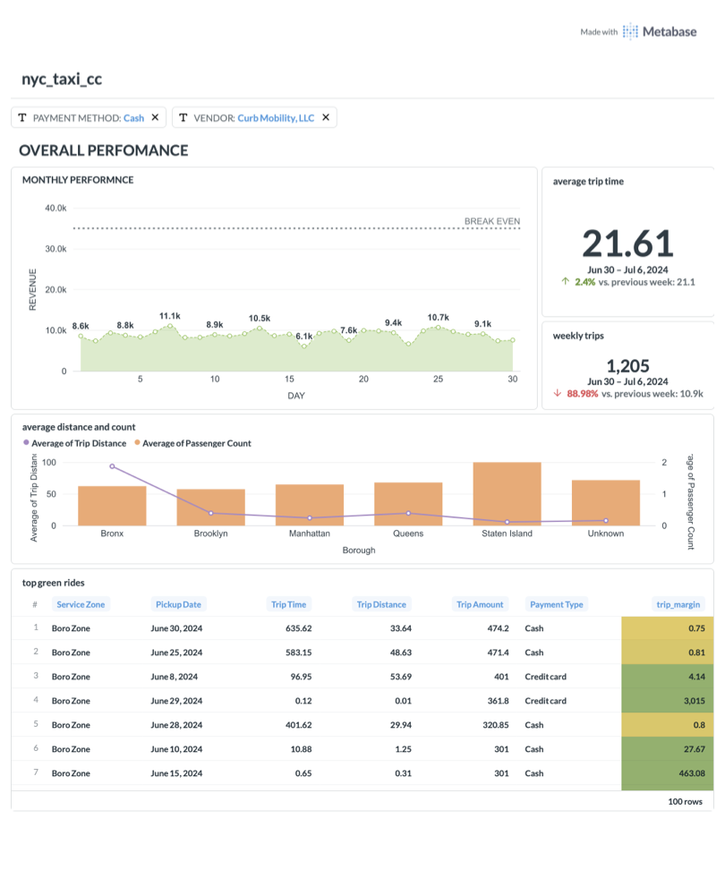

# NYC Taxi Data Pipeline

An end-to-end data engineering pipeline for NYC Taxi & Limousine Commission trip data, implementing both batch and real-time streaming ingestion with a medallion architecture (Bronze → Silver → Gold) for progressive data refinement.

## Architecture


## Dashboard



> [View full dashboard PDF](assets/dashboard.pdf)

## Tech Stack

| Category | Technology |
|---|---|
| **Orchestration** | Apache Airflow 2.10.4 |
| **Stream Processing** | Redpanda (Kafka-compatible) + confluent-kafka |
| **Batch Processing** | Apache Spark 4.1.1 / PySpark |
| **Data Warehouse** | PostgreSQL 16 |
| **Data Format** | Apache Parquet |
| **BI & Visualization** | Metabase |
| **Containerization** | Docker / Docker Compose |
| **Language** | Python 3.13, SQL |
| **Package Manager** | uv |

## Project Structure

```
nyc_taxi_cc/
├── airflow_service/          # Airflow DAGs for batch orchestration
│   ├── dags/
│   │   ├── data_ingestion.py         # Yellow taxi monthly ingestion
│   │   ├── green_cab_monthly.py      # Green taxi ETL pipeline
│   │   └── monthly_archival.py       # Data backup & archival
│   └── docker-compose.yml
├── kafka_service/            # Kafka/Redpanda streaming setup
│   ├── stream_to_kafka/
│   │   ├── producer.py               # Publishes ride events to Kafka
│   │   ├── ride.py                   # Ride data model (18 fields)
│   │   └── settings.py               # Broker & topic config
│   └── docker-compose.yml
├── spark_service/            # Spark standalone cluster
│   ├── spark_test.ipynb              # Batch processing notebooks
│   ├── spark_streaming_test.ipynb    # Streaming prototype
│   ├── Dockerfile
│   └── docker-compose.yml
├── spark-redpanda_service/   # Integrated streaming pipeline
│   ├── scripts/
│   │   ├── producer.py               # Parquet → Kafka producer
│   │   ├── consumer.py               # Kafka → Parquet (batch)
│   │   ├── consumer_streaming.py     # Kafka → PostgreSQL (streaming)
│   │   └── consumer_pgdump.py        # Kafka → PostgreSQL (batch)
│   ├── Dockerfile
│   └── docker-compose.yml
├── datawarehouse_service/    # PostgreSQL medallion schema
│   ├── nyc_taxi.psql                 # Bronze/Silver/Gold DDL & transforms
│   └── docker-compose.yml
├── bi_service/               # BI layer (Metabase)
│   ├── connetion.py                  # PostgreSQL connection loader
│   └── metabase.toml                 # Datasource configuration
├── data/                     # Parquet data files
│   ├── green_taxi/                   # Green taxi trip data (2025)
│   └── yellow_taxi/                  # Yellow taxi trip data (2024)
├── data_wrangling.ipynb      # EDA & data preparation notebook
└── pyproject.toml
```

## Data Pipeline

### Ingestion Patterns

**Batch (Airflow)**
- Yellow taxi: Monthly parquet ingestion with incremental loading (100K batch size)
- Green taxi: Download → Transform → PostgreSQL → Archive → Summarize
- Archival: Monthly backup of booking tables with timestamps

**Streaming (Kafka/Redpanda)**
- Producer reads parquet files and publishes ride events as JSON to Kafka topics
- Three consumer patterns available:
  - Batch extraction to Parquet
  - Structured Streaming to PostgreSQL (micro-batches every 10s)
  - Batch JDBC write to PostgreSQL

### Medallion Architecture

```
Bronze (Raw)                Silver (Cleaned)              Gold (Analytics-Ready)
───────────────────────    ───────────────────────       ───────────────────────
bronze_yellow_taxi_data    silver_green_taxi_data        gold_green_taxi_data
bronze_green_taxi_data     • Deduplicated                • Vendor name lookup
bronze_taxi_zone_lookup    • Zone enrichment (JOIN)      • Payment type decoded
                           • Data quality filters        • All dimensions
                           • Calculated fields             human-readable
                             (trip_time, pickup_date)    • BI-ready
```

### Key Transformations (Silver → Gold)

- Deduplication via `DISTINCT`
- Zone lookup joins for borough & service zone enrichment
- Data quality filters: `total_amount >= 0`, valid date ranges
- Calculated fields: trip duration in minutes, month extraction
- Null handling with `COALESCE` defaults
- Vendor ID → company name mapping
- Payment type code → descriptive label

## Services & Ports

| Service | Port | Purpose |
|---|---|---|
| Airflow Webserver | `8080` | DAG management UI |
| PostgreSQL | `5432` | Data warehouse |
| Redpanda Broker | `9092` | Kafka-compatible message broker |
| Redpanda Console | `8080` / `8081` | Kafka topic management UI |
| Spark Master | `7077` | Cluster coordination |
| Spark Master UI | `9090` | Spark jobs dashboard |
| Spark Application UI | `4040` | Active job monitoring |

## Getting Started

### Prerequisites

- Docker & Docker Compose
- Python 3.13+
- [uv](https://github.com/astral-sh/uv) (Python package manager)

### Setup

1. **Clone the repository**
   ```bash
   git clone https://github.com/DOthedot/nyc-taxi-data-pipeline.git
   cd nyc-taxi-data-pipeline
   ```

2. **Install Python dependencies**
   ```bash
   uv sync
   ```

3. **Start the data warehouse**
   ```bash
   docker compose -f datawarehouse_service/docker-compose.yml up -d
   ```

4. **Start Airflow (batch ingestion)**
   ```bash
   docker compose -f airflow_service/docker-compose.yml up -d
   ```

5. **Start Kafka/Redpanda (streaming)**
   ```bash
   docker compose -f kafka_service/docker-compose.yml up -d
   ```

6. **Start Spark cluster**
   ```bash
   docker compose -f spark-redpanda_service/docker-compose.yml up -d
   ```

### Running the Pipeline

**Batch ingestion** — Trigger DAGs from the Airflow UI at `localhost:8080`

**Streaming ingestion** — Run the Kafka producer, then start a consumer:
```bash
# Produce ride events
python spark-redpanda_service/scripts/producer.py

# Consume with streaming to PostgreSQL
python spark-redpanda_service/scripts/consumer_streaming.py
```

> **Note:** Always terminate Spark sessions after completing jobs to free up memory.

## Data Source

Trip data is sourced from the [NYC Taxi & Limousine Commission](https://www.nyc.gov/site/tlc/about/tlc-trip-record-data.page) public dataset, covering yellow and green taxi trips from 2024–2025.
